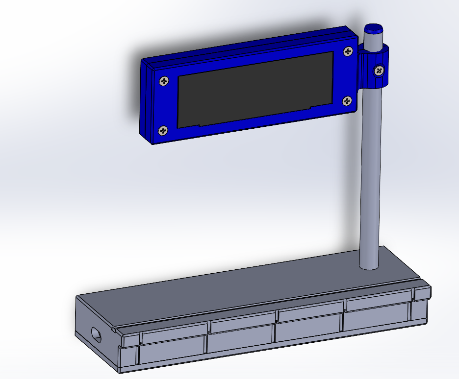

# ESP32 Train Schedule Monitor (Deutsche Bahn Style)

A desktop train schedule monitor stylized after the modern "DSA" (Dynamischer Schriftanzeiger) displays found on German railway platforms. It displays real-time departures for KVV (Karlsruher Verkehrsverbund) or Deutsche Bahn stations using an ESP32 and a high-resolution OLED display.

## ✨ Features

* **Hybrid Mode:** Fetches real-time data (API) when online. Falls back to a stored offline schedule if WiFi or the API is down.
* **Resilient Connectivity:** Auto-reconnects to WiFi. If the connection drops during the night, it updates as soon as the internet returns.
* **Automated Updates:**
    * **Backend:** GitHub Actions fetches the next 24h schedule every night (02:00 AM).
    * **Firmware:** The ESP32 downloads the new data file automatically at 03:00 AM (or upon reconnection).
* **Authentic Design:** Custom 3D-printed housing with an aluminum stand, modeled in SolidWorks.

## 📂 Repository Structure

* `firmware/`: MicroPython code for the ESP32 (Display driver, WiFi logic, Updater).
* `backend/`: Python script used by GitHub Actions to fetch data from KVV/EFA.
* `3d_models/`:
    * `stl/`: Ready-to-print files.
    * `step/`: CAD files for modification.
* `offline_data.py`: The daily generated schedule (updated automatically by the bot).

## 🛠 Hardware Required

1.  **MCU:** ESP32 DevKit V1 (30 pin).
2.  **Display:** 3.12" OLED SSD1322 (256x64 pixels, SPI interface).
3.  **Housing:** 3D printed parts (PLA/PETG) + Aluminum tube (10mm diameter).
4.  **Power:** USB Cable + 5V Adapter.

### Wiring (SPI)

| Display Pin | ESP32 Pin | Note |
| :--- | :--- | :--- |
| **VCC** | 3.3V | |
| **GND** | GND | |
| **SCK** (CLK) | GPIO 18 | |
| **MOSI** (DIN) | GPIO 23 | |
| **CS** | GPIO 5 | |
| **DC** | GPIO 17 | |
| **RST** | GPIO 16 | |

## 🚀 Installation Guide

### 1. GitHub Setup (Backend)
To enable automatic schedule updates, you need your own copy of this repository.

1.  **Fork** this repository.
2.  Go to `backend/kvv_processor.py` and change the `STOP_ID` to your desired station ID.
3.  Go to the **Actions** tab in your repository and enable workflows.
4.  (Optional) Run the "Update Schedule" workflow manually once to generate the first data file.

### 2. ESP32 Setup (Firmware)
1.  Flash your ESP32 with the latest **MicroPython** firmware.
2.  Open `firmware/main.py` and configure:
    * `WIFI_SSID` / `WIFI_PASS`: Your WiFi credentials.
    * `STOP_ID`: Your station ID (for real-time requests).
    * `LAT` / `LON`: Your coordinates (for local weather data).
3.  Open `firmware/schedule_updater.py` and update `GITHUB_RAW_URL` to point to **your** forked repository (`raw.githubusercontent.com/...`).
4.  Upload all files from the `firmware/` folder to the root directory of the ESP32.

## 🖨️ 3D Printing & Assembly

The design is modular and fully serviceable, using M3 bolts and nuts.

### Bill of Materials (BOM)
* **Bolts:**
    * M3 x 20mm (Required for the Base).
    * M3 x 25mm (Recommended for the Display Case, 20mm can also work, required for the Base at least 1).
    * Small screws (e.g., M2) for mounting the ESP32 (or use Superglue).
* **Nuts:** Standard M3 nuts.
* **Tube:** Aluminum tube, 10mm outer diameter.

### Printing Tips
* **Material:** PLA or PETG.
* **Adhesion:** The **Base** part is long and prone to warping. It is highly recommended to use **glue stick** or adhesive spray on the print bed to ensure it stays flat.
* **Nozzle:** Designed for a standard 0.4mm nozzle.

### Assembly Notes
1.  **The Screen Clips:**
    The mounting holes on the SSD1322 PCB are extremely close to the edge. Printing holes for them directly would result in fragile 1-layer walls. Instead, the screen is held in place by **special printed clips (clamps)** that are secured by the main case bolts. Do not try to put screws directly through the PCB holes.
2.  **The Tube (Drilling):**
    * **Display:** Assemble the front and back of the display case *first*. Then insert the tube and drill through the plastic and aluminum together. This ensures perfect alignment and prevents the drill from wobbling.
    * **Base:** Insert the tube into the base first, then drill the fixing hole.
3.  **The Tube (Fit):**
    The 10mm tube is designed for a **tight press-fit** into the Base. You may need to lightly hammer it in. This design feature prevents the tube from rotating even before the locking bolt is inserted.
4.  **ESP32 Mounting:**
    The ESP32 can be secured in the base using small screws (if your board has holes) or simply glued in place with a drop of superglue.

## 💡 Notes

**Keep-Alive Mechanism:**
GitHub disables Actions after 60 days of inactivity. To prevent this, I use a simple cron script on a local Raspberry Pi that pushes a small update to `keep_alive_log.txt` once a month. This ensures the daily schedule updates continue indefinitely without manual intervention.

## 📜 License
This project is open-source. Feel free to modify and build your own!
